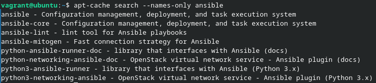
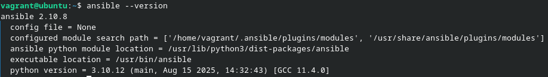
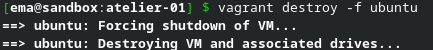

# Challenge 1 - Laurent Boualavong

## Démarrez la VM ```ubuntu``` depuis le répertoire ```atelier-01```

```bash
vagrant up ubuntu
````

## Connectez-vous à cette VM

```bash
vagrant ssh ubuntu
```

## Rafraîchissez les informations sur les paquets

```bash
sudo apt update
```

## Recherchez le paquet `ansible` avec les options qui vont bien

```bash
apt-cache search --names-only ansible
```



Ici, on voudra utiliser le package "ansible"

## Installez le paquet officiel fourni par la distribution

```bash
sudo apt install -y ansible
```

## Vérifiez si l'installation s'est bien déroulée & notez la version

```bash
ansible --version
```

Le retour de cette commande nous confirme qu'ansible est correctement installé et nous donne la version qui est installée.



## Déconnectez-vous et supprimez la VM

```bash
exit
```

Une fois déconnecté de la VM, on peut la supprimer :

```bash
vagrant destroy -f ubuntu
```


