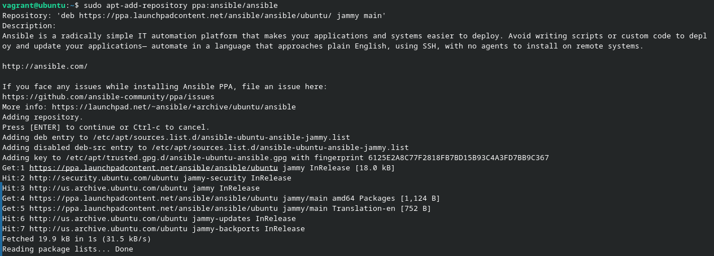
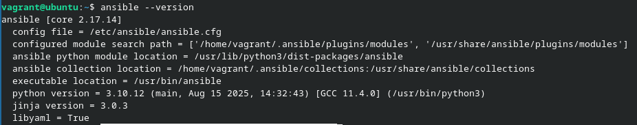

# Challenge 2 - Laurent Boualavong

## Connexion à la box Ubuntu

La connexion se fait de la même manière que pour le challenge 1. Une fois dans la VM, on fait ```sudo apt update``` pour rafraichir les informations sur les paquets.

## Configuration du dépôt PPA

Une fois les informations sur les dépôt à jour, on peut configurer le dépôt PPA.

```bash
sudo apt-add-repository ppa:ansible/ansible
```


On peut ensuite procéder à l'installation d'ansible.

## Installation d'ansible et vérification de la version

```bash
sudo apt install -y ansible
```
```bash
ansible --version
```


On remarque que la version installée via les dépôt PPA est différente de celle de la version officielle.
