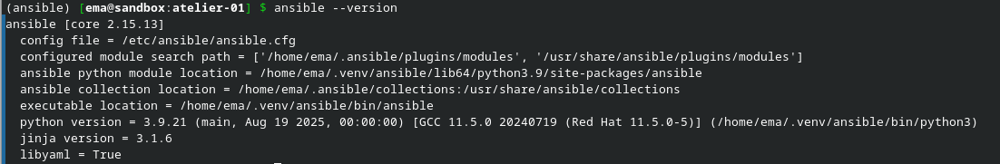

# Challenge 3 - Laurent Boualavong

## Lancement de la VM Rocky

Encore une fois le lancement se fait de la même manière que pour les challenges précédents : 

```bash
vagrant up rocky
```

```bash
vagrant ssh rocky
```

## Mise en place du venv

On commence par installer l'environement Virtualenv (venv)

``bash
python3 -m venv ~/.venv/ansible
```
Dans le cas ici, on appelle le venv "ansible" mais le nom n'a pas d'importance.

On lance ensuite le venv :

```bash
source ~/.venv/ansible/bin/activate
```
Une fois lancé, on peut mettre à jour PIP :

```bash
pip install --upgrade pip
```
Et pour terminer, on peut lancer l'installation d'ansible via PIP :

```bash
pip install ansible
```
## Version d'ansible

Pour terminer on peut faire un ```ansible --version``` afin de verifier que l'installation s'est bien déroulée et verifier la version d'ansible qui a été installée.


