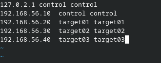
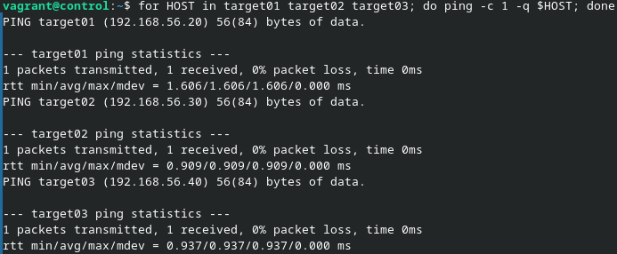
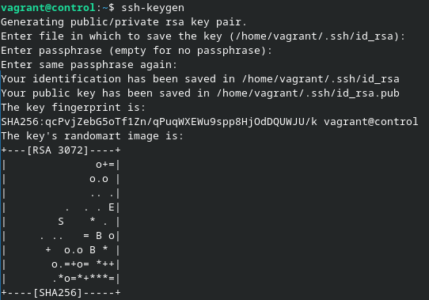
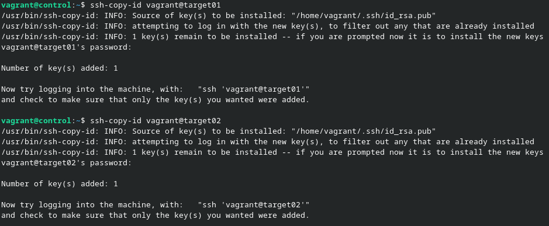
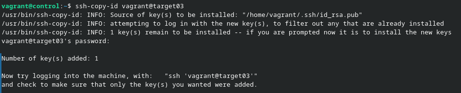
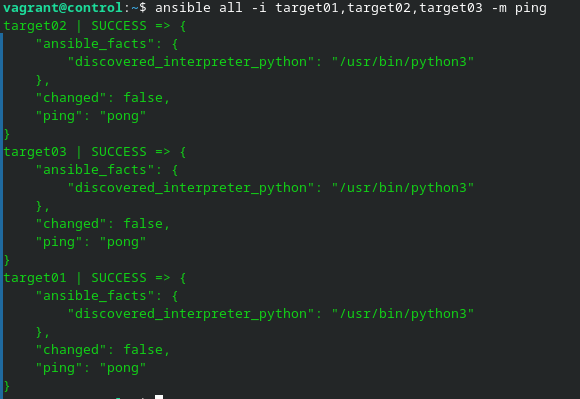

# Challenge 4 - Laurent Boualavong

## Lancement des VMs

On commence par lancer les VMs du challenge avec ```vagrant up``` et on se connecte en ssh à la machine de contrôle ```vagrant ssh control```.

## Mise en place d'un mini DNS

Dans le fichier ```/etc/hosts``` de la machine, on va définir un mini DNS permettant d'associer des nom d'hôtes à des IP.



On va ensuite tester la connectivité avec les nom d'hôtes.



## Authentification

Pour commencer, je récupère les clés SSH publiques des mes autres machines pour les placer dans le fichier known_hosts de ma machine contrôle : ```ssh-keyscan -t rsa target01 target02 target03 >> .ssh/known_hosts```.

Sur la machine contôle, je créé une paire de clé SSH avec ``ssh-keygen``



Je vais ensuite distribuer ma clé publique à toutes les autres machines avec ```ssh-copy-id```





On peut maintenant tester l'ensemble en faisant le ping ```ansible all -i target01,target02,target03 -m ping```


