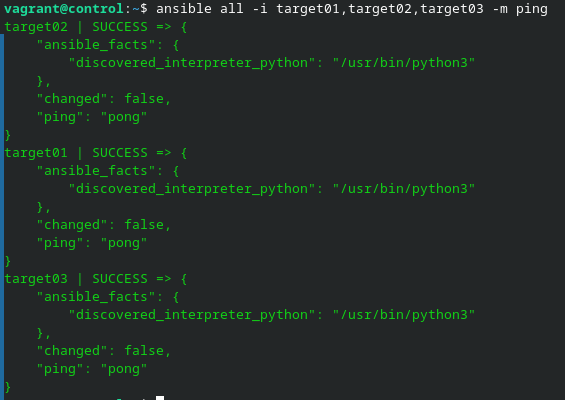
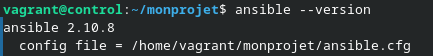
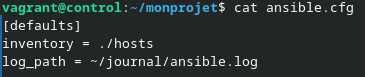
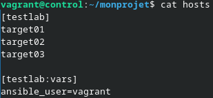
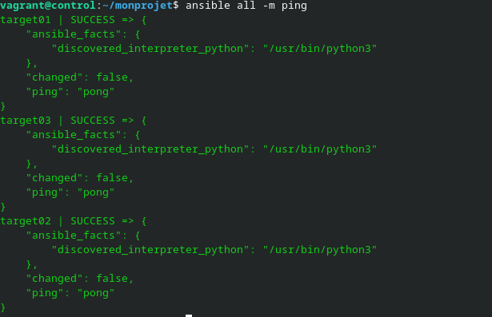
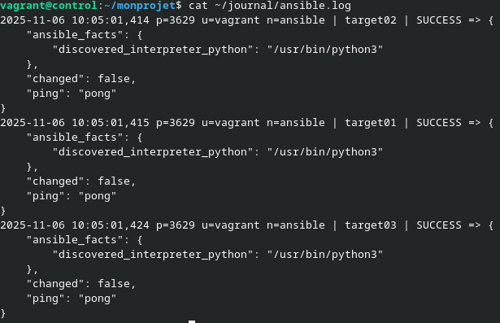
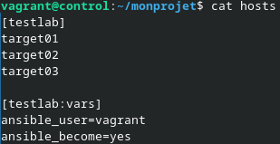

# Challenge 5 - Laurent Boualavong

## Mise en place de l'environnement

Dans un premier temps il faudra lancer la machine control (ControlHost) et refaire tout le procédé du challenge précédent afin de pouvoir ping toutes les machines.
Après avoir configuré le mini DNS, mis en place l'authentification et installé ansible, il devrait être possible de ping les machines.



## Configuration

Dans un nouveau répertoire ```~/monprojet```, je créé un fichier ```ansible.cfg``` et je fais ```ansible --version``` pour vérifier que le fichier est bien pris en compte.



Il faut ensuite définir dedans un inventaire que nous allons nommer ```hosts``` et activer les logs que nous stockerons dans ```~/journal/ansible.log```.



Dans un fichier ```~/monprojet/logs``` on va définir un groupe testlab avec tous les TargetHosts. On définit au passage que c'est l'utilisateur vagrant qui est utilisé pour la connexion.



On peut maintenant tester cette configuration en tentant un ping sans définir les nom d'hôte dans la commande.



On peut aussi aller voir dans notre fichier de logs si tout a bien foncitonné.



## Afficher ```/etc/shadow```

Dans un premier temps il faut définir une élévation de privilège pour pouvoir accéder au contenu de ```/etc/shadow```. On rajoute une ligne dans ```hosts```.



On peut ensuite envoyer la directive d'afficher le début de ```/etc/shadow``` aux TargetHosts.


