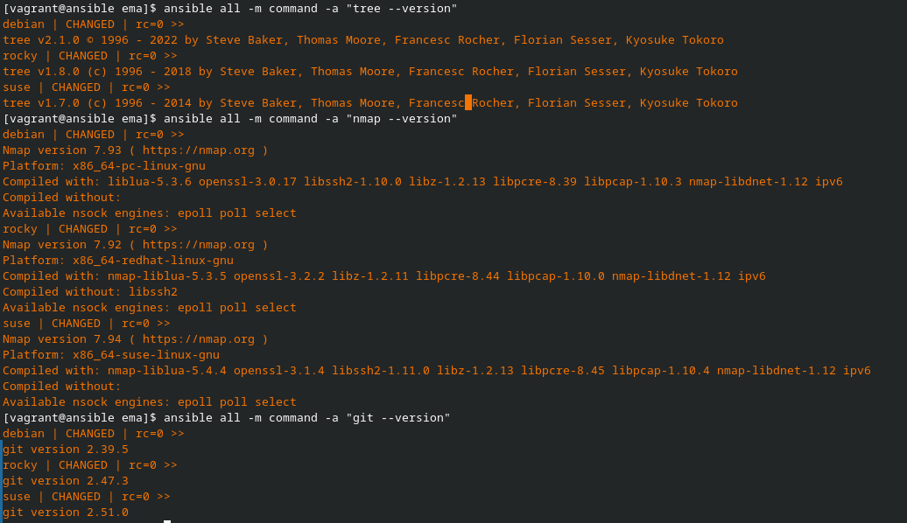
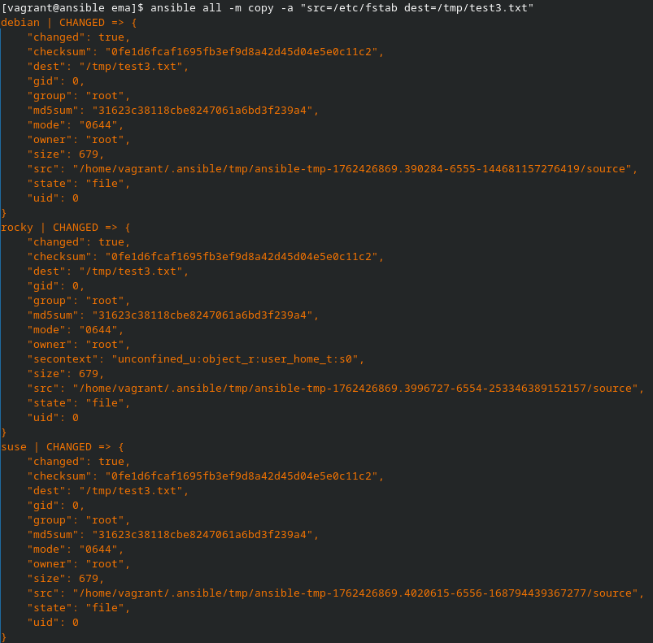
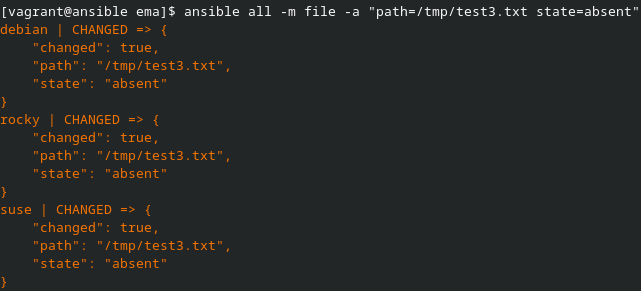
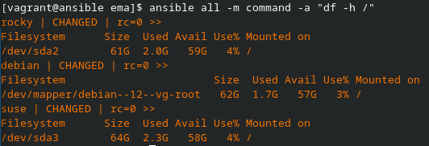

# Challenge 6 - Laurent Boualavong

## Installation des packages

Pour installer les paquets ```tree``` ```git``` et ```nmap``` on va lancer successivement les 3 commandes suivantes

```bash
# Installer tree
ansible all -m package -a "name=tree state=present"

# Installer git
ansible all -m package -a "name=git state=present"

# Installer nmap
ansible all -m package -a "name=nmap state=present"
```
On peut remarquer la bonne installation des paquets en allant consulter leur version

```bash
# Version tree
ansible all -m command -a "tree --version"

# Version Nmap
ansible all -m command -a "nmap --version"

# Version git
ansible all -m command -a "git --version"
```


## Désinstallation des packages

Pour désintaller les packages, il suffit de faire la même commande que l'installation mais avec ```state=absent```.


```bash
# Désinstaller tree
ansible all -m package -a "name=tree state=absent"

# Désinstaller git
ansible all -m package -a "name=git state=absent"

# Désinstaller nmap
ansible all -m package -a "name=nmap state=absent"
```

## Copie de fichier

Ici on va essayer de prendre un fichier de notre ControlHost pour le copier dans chacun de nos TargetHosts.

```bash
ansible all -m copy -a "src=/etc/fstab dest=/tmp/test3.txt"
```



## Suppression de fichier

Pour supprimer, cela marche de la même manière que pour les packgaes on va rajouter ```state=absent``` et utiliser le module ```file```.

```bash
ansible all -m file -a "path=/tmp/test3.txt state=absent"
```


Pour ces deux commandes on remarque qu'il est possible de réaliser ce genre d'opération sur de nombreuses machines en même temps et en s'assurant un résultat identique.

## Afficher l'espace disque

Pour afficher l'espace disque de toutes les machines en même temps on peut utiliser le module ```command```.

```bash
ansible all -m command -a "df -h /" 
```
> Note : il est aussi possible de faire la commande ```ansible all -a "df -h /"```



On remarque pour cette commande que l'état est à ```CHANGED``` alors qu'aucune modification n'est apportée. Cela nous faire dire que la commande ```df``` n'est pas idempotente. 
